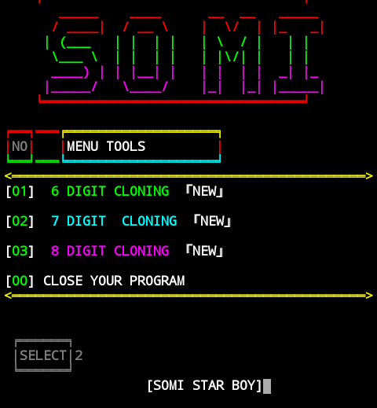

# digit 
 

  

<!--    -->

<!--    -->

# Installation :

😈 `apt update`

😈 `apt upgrade -y`

😈 `apt install git -y`

😈 `pkg install python`

😈 `pkg install python2 -y`

😈 `pip2 install requests`

😈 `pip2 install mechanize`

😈 `apt install ruby -y && gem install lolcat`

😈 `git clone https://github.com/Somi190/digit.git`

😈 `cd digit`

👾 `sh digit.sh`

